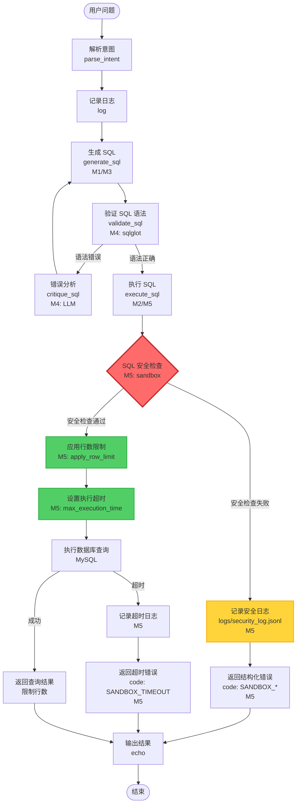

```mermaid
graph TD
    Start([用户问题]) --> ParseIntent[解析意图<br/>parse_intent]
    ParseIntent --> Log[记录日志<br/>log]
    Log --> GenerateSQL[生成 SQL<br/>generate_sql<br/>M1/M3]
    
    GenerateSQL --> ValidateSQL[验证 SQL 语法<br/>validate_sql<br/>M4: sqlglot]
    
    ValidateSQL -->|语法错误| Critique[错误分析<br/>critique_sql<br/>M4: LLM]
    Critique --> GenerateSQL
    
    ValidateSQL -->|语法正确| ExecuteSQL[执行 SQL<br/>execute_sql<br/>M2/M5]
    
    ExecuteSQL --> SandboxCheck{SQL 安全检查<br/>M5: sandbox}
    
    SandboxCheck -->|安全检查失败| SecurityLog[记录安全日志<br/>logs/security_log.jsonl<br/>M5]
    SecurityLog --> ErrorResult[返回结构化错误<br/>code: SANDBOX_*<br/>M5]
    ErrorResult --> Echo[输出结果<br/>echo]
    
    SandboxCheck -->|安全检查通过| ApplyLimits[应用行数限制<br/>M5: apply_row_limit]
    ApplyLimits --> SetTimeout[设置执行超时<br/>M5: max_execution_time]
    SetTimeout --> ExecuteQuery[执行数据库查询<br/>MySQL]
    
    ExecuteQuery -->|超时| TimeoutLog[记录超时日志<br/>M5]
    TimeoutLog --> TimeoutError[返回超时错误<br/>code: SANDBOX_TIMEOUT<br/>M5]
    TimeoutError --> Echo
    
    ExecuteQuery -->|成功| SuccessResult[返回查询结果<br/>限制行数]
    SuccessResult --> Echo
    
    Echo --> End([结束])
    
    style SandboxCheck fill:#ff6b6b,stroke:#c92a2a,stroke-width:3px
    style SecurityLog fill:#ffd43b,stroke:#fab005,stroke-width:2px
    style ApplyLimits fill:#51cf66,stroke:#37b24d,stroke-width:2px
    style SetTimeout fill:#51cf66,stroke:#37b24d,stroke-width:2px
```
