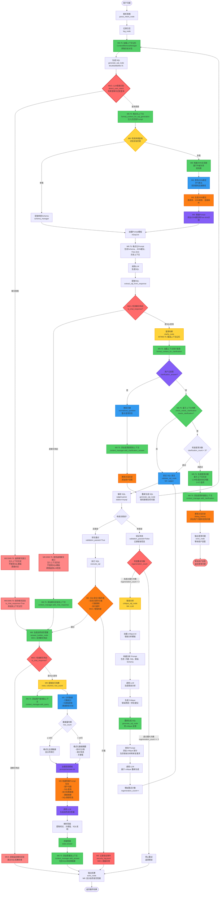

```mermaid
graph TD
    Start([用户问题]) --> ParseIntent[解析意图<br/>parse_intent_node]
    ParseIntent --> Log[记录日志<br/>log_node]
    Log --> LoadContext[M9.75: 加载上下文记忆<br/>ContextMemoryManager<br/>获取历史对话]
    LoadContext --> GenerateSQL[生成 SQL<br/>generate_sql_node<br/>M1/M3/M8/M9.75]
    
    GenerateSQL --> DetectIntent{M9.5: LLM意图识别<br/>detect_user_intent<br/>判断是聊天还是查询}
    
    DetectIntent -->|聊天意图| ChatLLM[M9.5/M9.75: 通用聊天接口<br/>注入上下文历史<br/>不使用SQL模板<br/>直接对话]
    DetectIntent -->|查询意图| FormatContext[M9.75: 格式化上下文<br/>format_context_for_sql_generation<br/>注入历史到Prompt]
    FormatContext --> DetectMultiTable{M8: 检测多表查询<br/>识别涉及的表}
    
    ChatLLM --> ChatResponse2[M9.5/M9.75: 保存聊天回复<br/>is_chat_response=True<br/>添加到上下文记忆]
    ChatResponse2 --> AnswerBuilder
    
    DetectMultiTable -->|单表| GetSchema[获取单表Schema<br/>schema_manager]
    DetectMultiTable -->|多表| BuildJoinGraph[M8: 构建JOIN关系图<br/>基于外键关系<br/>双向图]
    
    BuildJoinGraph --> FindJoinPath[M8: 查找JOIN路径<br/>BFS算法<br/>找到最短连接路径]
    
    FindJoinPath --> GenerateJoinSuggestions[M8: 生成JOIN建议<br/>表顺序、JOIN类型、连接条件]
    
    GenerateJoinSuggestions --> EnhancePrompt[M8: 增强Prompt<br/>添加JOIN路径和Few-shot示例]
    
    GetSchema --> LoadPrompt[加载Prompt模板<br/>nl2sql.txt]
    EnhancePrompt --> LoadPrompt
    
    LoadPrompt --> FormatPrompt[M9.75: 格式化Prompt<br/>包含Schema、JOIN建议、Few-shot<br/>历史上下文]
    
    FormatPrompt --> CallLLM[调用LLM<br/>生成SQL]
    
    CallLLM --> ExtractSQL[提取SQL<br/>extract_sql_from_response]
    
    ExtractSQL --> DetectChat{M9.5: 检测聊天响应<br/>is_chat_response?}
    
    DetectChat -->|是聊天响应| ChatResponse[M9.5/M9.75: 使用通用聊天接口<br/>注入上下文历史<br/>不使用SQL模板<br/>直接返回LLM回复]
    DetectChat -->|是SQL查询| Clarify[澄清判断<br/>clarify_node<br/>M7/M9.75: 集成上下文记忆]
    
    ChatResponse --> AddChatToContext[M9.75: 添加聊天回复到上下文<br/>context_manager.add_chat_response]
    AddChatToContext --> AnswerBuilder
    
    Clarify --> LoadContextForClarify[M9.75: 加载上下文用于澄清<br/>format_context_for_clarification]
    LoadContextForClarify --> CheckAnswer{用户已回答<br/>clarification_answer?}
    
    CheckAnswer -->|是| UpdateQuestion[更新问题<br/>normalized_question<br/>整合澄清信息]
    CheckAnswer -->|否| CheckNeedsClarify{M9.75: 基于上下文判断<br/>check_needs_clarification<br/>needs_clarification?}
    
    CheckNeedsClarify -->|否| ValidateSQL[验证 SQL 语法<br/>validate_sql_node<br/>M4: sqlglot]
    CheckNeedsClarify -->|是| CheckMaxClarify{检查澄清次数<br/>clarification_count < 3?}
    
    CheckMaxClarify -->|超过| ValidateSQL
    CheckMaxClarify -->|未超过| GenerateClarify[M9.75: 生成澄清问题<br/>基于上下文历史<br/>LLM生成封闭式问题<br/>3-5个选项]
    
    GenerateClarify --> AddClarifyToContext[M9.75: 添加澄清问题到上下文<br/>context_manager.add_clarification]
    AddClarifyToContext --> UpdateDialogHistory[更新对话历史<br/>dialog_history<br/>添加用户问题和澄清问题]
    UpdateDialogHistory --> EchoClarify[输出澄清问题<br/>echo_node<br/>等待用户回答]
    EchoClarify --> EndClarify([等待用户回答<br/>返回澄清问题])
    
    UpdateQuestion --> AddClarifyAnswer[M9.75: 添加澄清回答到上下文<br/>context_manager.add_clarification_answer]
    AddClarifyAnswer --> UpdateDialogHistory2[更新对话历史<br/>添加用户回答]
    UpdateDialogHistory2 --> RegenerateSQL[重新生成 SQL<br/>generate_sql_node<br/>使用更新后的问题]
    RegenerateSQL --> LoadContext
    
    ValidateSQL --> ParseSQL[解析 SQL<br/>sqlglot.parse<br/>dialect=mysql]
    ParseSQL --> CheckErrors{有语法错误?}
    
    CheckErrors -->|无错误| ValidationPass[验证通过<br/>validation_passed=True]
    CheckErrors -->|有错误| ValidationFail[验证失败<br/>validation_passed=False<br/>记录错误信息]
    
    ValidationPass --> ExecuteSQL[执行 SQL<br/>execute_sql]
    
    ValidationFail --> CheckRetries{检查重试次数<br/>regeneration_count}
    
    CheckRetries -->|未超过最大次数<br/>regeneration_count < 3| CritiqueSQL[错误分析<br/>critique_sql_node<br/>M4: LLM]
    CheckRetries -->|超过最大次数<br/>regeneration_count >= 3| Fail[停止重试<br/>返回错误]
    
    CritiqueSQL --> LoadCritiquePrompt[加载 critique.txt<br/>错误分析模板]
    LoadCritiquePrompt --> BuildCritiquePrompt[构建分析 Prompt<br/>包含: 问题, SQL, 错误, Schema]
    BuildCritiquePrompt --> CallLLM3[调用 LLM<br/>生成错误分析]
    CallLLM3 --> GenerateCritique[生成 Critique<br/>错误原因 + 修复建议]
    
    GenerateCritique --> RegenerateSQL2[重新生成 SQL<br/>generate_sql_node<br/>带 critique 反馈]
    RegenerateSQL2 --> ModifyPrompt[修改 Prompt<br/>添加 critique 部分<br/>包含错误分析和修复要求]
    ModifyPrompt --> CallLLM4[调用 LLM<br/>基于 critique 重新生成]
    CallLLM4 --> IncrementCount[增加重试计数<br/>regeneration_count++]
    
    IncrementCount --> ValidateSQL
    
    ExecuteSQL --> SecurityCheck{M5: SQL安全沙箱检查<br/>- 危险关键字拦截<br/>- 行数限制<br/>- 执行超时<br/>M9.5: 增强检查}
    
    SecurityCheck -->|通过| AnswerBuilder[M9: 生成自然语言答案<br/>answer_builder_node<br/>M9.5: 支持聊天响应]
    SecurityCheck -->|拦截| SecurityLog[M5: 记录安全事件<br/>security_log.jsonl<br/>M9.5: 脱敏处理]
    
    SecurityLog --> EchoResult
    
    AnswerBuilder --> CheckChatResponse{M9.5: 检查聊天响应<br/>is_chat_response?}
    
    CheckChatResponse -->|是聊天响应| ReturnChat[M9.5: 直接返回聊天回复<br/>跳过SQL结果处理]
    CheckChatResponse -->|是SQL查询| ExtractData[M9: 提取执行结果<br/>rows, columns, row_count]
    
    ReturnChat --> EchoResult
    
    ExtractData --> AddQueryToContext[M9.75: 添加用户查询到上下文<br/>context_manager.add_query]
    
    ExtractData --> AnalyzeData[M9: 分析数据<br/>- 行数统计<br/>- 关键值提取<br/>- 数据类型识别]
    
    AnalyzeData --> CheckRowCount{数据量判断<br/>row_count}
    
    CheckRowCount -->|≤ 10行| FormatAllData[格式化全部数据<br/>显示所有行]
    CheckRowCount -->|> 10行| FormatSummary[格式化数据摘要<br/>- 前5行示例<br/>- 统计信息<br/>- 关键值]
    
    FormatAllData --> LoadAnswerPrompt[加载答案模板<br/>prompts/answer.txt]
    FormatSummary --> LoadAnswerPrompt
    
    LoadAnswerPrompt --> BuildAnswerPrompt[M9: 构建答案Prompt<br/>包含:<br/>- 用户问题<br/>- SQL查询<br/>- 执行结果数据<br/>- 数据摘要<br/>- SQL溯源信息]
    
    BuildAnswerPrompt --> CallLLM5[调用 LLM<br/>生成自然语言答案]
    
    CallLLM5 --> ParseAnswer[解析答案<br/>提取结论、关键值、SQL说明]
    
    ParseAnswer --> StoreAnswer[存储答案<br/>state.answer]
    
    StoreAnswer --> AddAnswerToContext[M9.75: 添加答案到上下文<br/>context_manager.add_answer<br/>包含SQL和结果摘要]
    AddAnswerToContext --> EchoResult[输出结果<br/>echo_node<br/>M9: 显示自然语言答案]
    Fail --> EchoResult
    EchoResult --> End([返回最终结果])
    
    style DetectMultiTable fill:#ffd43b,stroke:#fab005,stroke-width:3px
    style BuildJoinGraph fill:#51cf66,stroke:#37b24d,stroke-width:3px
    style FindJoinPath fill:#339af0,stroke:#1c7ed6,stroke-width:3px
    style GenerateJoinSuggestions fill:#fd7e14,stroke:#e8590c,stroke-width:2px
    style EnhancePrompt fill:#845ef7,stroke:#5f3dc4,stroke-width:2px
    style Clarify fill:#ffd43b,stroke:#fab005,stroke-width:3px
    style GenerateClarify fill:#51cf66,stroke:#37b24d,stroke-width:3px
    style UpdateQuestion fill:#339af0,stroke:#1c7ed6,stroke-width:2px
    style CheckNeedsClarify fill:#ff6b6b,stroke:#c92a2a,stroke-width:2px
    style CheckAnswer fill:#845ef7,stroke:#5f3dc4,stroke-width:2px
    style UpdateDialogHistory fill:#fd7e14,stroke:#e8590c,stroke-width:2px
    style UpdateDialogHistory2 fill:#fd7e14,stroke:#e8590c,stroke-width:2px
    style EndClarify fill:#ff8787,stroke:#c92a2a,stroke-width:2px,stroke-dasharray: 5 5
    style ValidateSQL fill:#339af0,stroke:#1c7ed6,stroke-width:3px
    style CritiqueSQL fill:#ffd43b,stroke:#fab005,stroke-width:3px
    style RegenerateSQL2 fill:#51cf66,stroke:#37b24d,stroke-width:2px
    style CheckRetries fill:#ff6b6b,stroke:#c92a2a,stroke-width:2px
    style AnswerBuilder fill:#51cf66,stroke:#37b24d,stroke-width:3px
    style ExtractData fill:#ffd43b,stroke:#fab005,stroke-width:3px
    style AnalyzeData fill:#339af0,stroke:#1c7ed6,stroke-width:3px
    style LoadAnswerPrompt fill:#845ef7,stroke:#5f3dc4,stroke-width:2px
    style BuildAnswerPrompt fill:#fd7e14,stroke:#e8590c,stroke-width:2px
    style CallLLM5 fill:#845ef7,stroke:#5f3dc4,stroke-width:2px
    style StoreAnswer fill:#51cf66,stroke:#37b24d,stroke-width:2px
    style LoadContext fill:#51cf66,stroke:#37b24d,stroke-width:3px
    style FormatContext fill:#51cf66,stroke:#37b24d,stroke-width:2px
    style LoadContextForClarify fill:#51cf66,stroke:#37b24d,stroke-width:2px
    style AddChatToContext fill:#51cf66,stroke:#37b24d,stroke-width:2px
    style AddClarifyToContext fill:#51cf66,stroke:#37b24d,stroke-width:2px
    style AddClarifyAnswer fill:#51cf66,stroke:#37b24d,stroke-width:2px
    style AddQueryToContext fill:#51cf66,stroke:#37b24d,stroke-width:2px
    style AddAnswerToContext fill:#51cf66,stroke:#37b24d,stroke-width:2px
    style DetectIntent fill:#ff6b6b,stroke:#c92a2a,stroke-width:3px
    style ChatLLM fill:#ff8787,stroke:#c92a2a,stroke-width:2px
    style ChatResponse fill:#ff8787,stroke:#c92a2a,stroke-width:2px
    style ChatResponse2 fill:#ff8787,stroke:#c92a2a,stroke-width:2px
    style DetectChat fill:#ff6b6b,stroke:#c92a2a,stroke-width:2px
    style CheckChatResponse fill:#ff6b6b,stroke:#c92a2a,stroke-width:2px
    style ReturnChat fill:#ff8787,stroke:#c92a2a,stroke-width:2px
    style CheckNeedsClarify fill:#51cf66,stroke:#37b24d,stroke-width:2px
    style GenerateClarify fill:#51cf66,stroke:#37b24d,stroke-width:3px
    style SecurityCheck fill:#fd7e14,stroke:#e8590c,stroke-width:3px
    style SecurityLog fill:#ff6b6b,stroke:#c92a2a,stroke-width:2px
```