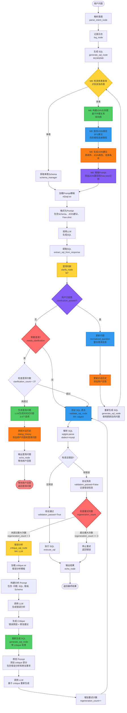

```mermaid
graph TD
    Start([用户问题]) --> ParseIntent[解析意图<br/>parse_intent_node]
    ParseIntent --> Log[记录日志<br/>log_node]
    Log --> GenerateSQL[生成 SQL<br/>generate_sql_node<br/>M1/M3/M8]
    
    GenerateSQL --> DetectMultiTable{M8: 检测多表查询<br/>识别涉及的表}
    
    DetectMultiTable -->|单表| GetSchema[获取单表Schema<br/>schema_manager]
    DetectMultiTable -->|多表| BuildJoinGraph[M8: 构建JOIN关系图<br/>基于外键关系<br/>双向图]
    
    BuildJoinGraph --> FindJoinPath[M8: 查找JOIN路径<br/>BFS算法<br/>找到最短连接路径]
    
    FindJoinPath --> GenerateJoinSuggestions[M8: 生成JOIN建议<br/>表顺序、JOIN类型、连接条件]
    
    GenerateJoinSuggestions --> EnhancePrompt[M8: 增强Prompt<br/>添加JOIN路径和Few-shot示例]
    
    GetSchema --> LoadPrompt[加载Prompt模板<br/>nl2sql.txt]
    EnhancePrompt --> LoadPrompt
    
    LoadPrompt --> FormatPrompt[格式化Prompt<br/>包含Schema、JOIN建议、Few-shot]
    
    FormatPrompt --> CallLLM[调用LLM<br/>生成SQL]
    
    CallLLM --> ExtractSQL[提取SQL<br/>extract_sql_from_response]
    
    ExtractSQL --> Clarify[澄清判断<br/>clarify_node<br/>M7]
    
    Clarify --> CheckAnswer{用户已回答<br/>clarification_answer?}
    
    CheckAnswer -->|是| UpdateQuestion[更新问题<br/>normalized_question<br/>整合澄清信息]
    CheckAnswer -->|否| CheckNeedsClarify{需要澄清?<br/>needs_clarification}
    
    CheckNeedsClarify -->|否| ValidateSQL[验证 SQL 语法<br/>validate_sql_node<br/>M4: sqlglot]
    CheckNeedsClarify -->|是| CheckMaxClarify{检查澄清次数<br/>clarification_count < 3?}
    
    CheckMaxClarify -->|超过| ValidateSQL
    CheckMaxClarify -->|未超过| GenerateClarify[生成澄清问题<br/>LLM生成封闭式问题<br/>3-5个选项]
    
    GenerateClarify --> UpdateDialogHistory[更新对话历史<br/>dialog_history<br/>添加用户问题和澄清问题]
    UpdateDialogHistory --> EchoClarify[输出澄清问题<br/>echo_node<br/>等待用户回答]
    EchoClarify --> EndClarify([等待用户回答<br/>返回澄清问题])
    
    UpdateQuestion --> UpdateDialogHistory2[更新对话历史<br/>添加用户回答]
    UpdateDialogHistory2 --> RegenerateSQL[重新生成 SQL<br/>generate_sql_node<br/>使用更新后的问题]
    RegenerateSQL --> DetectMultiTable
    
    ValidateSQL --> ParseSQL[解析 SQL<br/>sqlglot.parse<br/>dialect=mysql]
    ParseSQL --> CheckErrors{有语法错误?}
    
    CheckErrors -->|无错误| ValidationPass[验证通过<br/>validation_passed=True]
    CheckErrors -->|有错误| ValidationFail[验证失败<br/>validation_passed=False<br/>记录错误信息]
    
    ValidationPass --> ExecuteSQL[执行 SQL<br/>execute_sql]
    
    ValidationFail --> CheckRetries{检查重试次数<br/>regeneration_count}
    
    CheckRetries -->|未超过最大次数<br/>regeneration_count < 3| CritiqueSQL[错误分析<br/>critique_sql_node<br/>M4: LLM]
    CheckRetries -->|超过最大次数<br/>regeneration_count >= 3| Fail[停止重试<br/>返回错误]
    
    CritiqueSQL --> LoadCritiquePrompt[加载 critique.txt<br/>错误分析模板]
    LoadCritiquePrompt --> BuildCritiquePrompt[构建分析 Prompt<br/>包含: 问题, SQL, 错误, Schema]
    BuildCritiquePrompt --> CallLLM3[调用 LLM<br/>生成错误分析]
    CallLLM3 --> GenerateCritique[生成 Critique<br/>错误原因 + 修复建议]
    
    GenerateCritique --> RegenerateSQL2[重新生成 SQL<br/>generate_sql_node<br/>带 critique 反馈]
    RegenerateSQL2 --> ModifyPrompt[修改 Prompt<br/>添加 critique 部分<br/>包含错误分析和修复要求]
    ModifyPrompt --> CallLLM4[调用 LLM<br/>基于 critique 重新生成]
    CallLLM4 --> IncrementCount[增加重试计数<br/>regeneration_count++]
    
    IncrementCount --> ValidateSQL
    
    ExecuteSQL --> EchoResult[输出结果<br/>echo_node]
    Fail --> EchoResult
    EchoResult --> End([返回最终结果])
    
    style DetectMultiTable fill:#ffd43b,stroke:#fab005,stroke-width:3px
    style BuildJoinGraph fill:#51cf66,stroke:#37b24d,stroke-width:3px
    style FindJoinPath fill:#339af0,stroke:#1c7ed6,stroke-width:3px
    style GenerateJoinSuggestions fill:#fd7e14,stroke:#e8590c,stroke-width:2px
    style EnhancePrompt fill:#845ef7,stroke:#5f3dc4,stroke-width:2px
    style Clarify fill:#ffd43b,stroke:#fab005,stroke-width:3px
    style GenerateClarify fill:#51cf66,stroke:#37b24d,stroke-width:3px
    style UpdateQuestion fill:#339af0,stroke:#1c7ed6,stroke-width:2px
    style CheckNeedsClarify fill:#ff6b6b,stroke:#c92a2a,stroke-width:2px
    style CheckAnswer fill:#845ef7,stroke:#5f3dc4,stroke-width:2px
    style UpdateDialogHistory fill:#fd7e14,stroke:#e8590c,stroke-width:2px
    style UpdateDialogHistory2 fill:#fd7e14,stroke:#e8590c,stroke-width:2px
    style EndClarify fill:#ff8787,stroke:#c92a2a,stroke-width:2px,stroke-dasharray: 5 5
    style ValidateSQL fill:#339af0,stroke:#1c7ed6,stroke-width:3px
    style CritiqueSQL fill:#ffd43b,stroke:#fab005,stroke-width:3px
    style RegenerateSQL2 fill:#51cf66,stroke:#37b24d,stroke-width:2px
    style CheckRetries fill:#ff6b6b,stroke:#c92a2a,stroke-width:2px
```